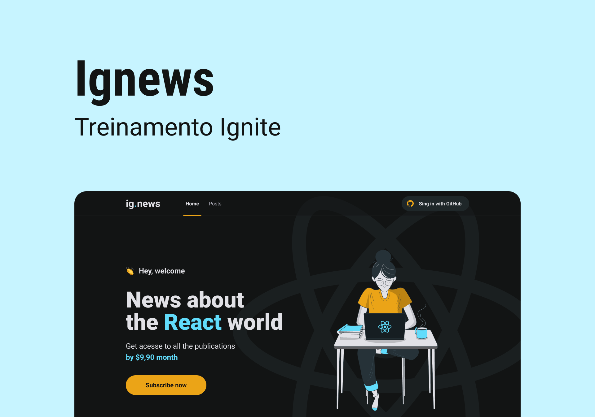

  

<h1 align="center">
  ig.news
</h1>

### 🧰 Tecnologias
- [ReactJS](https://pt-br.reactjs.org/)
- [NextJS](https://nextjs.org/)
- [TypeScript](https://www.typescriptlang.org/)
- [Stripe (for payments)](https://stripe.com/br)
- [FaunaDB](https://fauna.com/)
- [NextAuth.js](https://next-auth.js.org/)

### 💻 O projeto
Uma plataforma de conteúdos sob assinatura para desenvolvedores React

### 🧠 Aprendizados
#### Conceito de Serverless

> server + less = servidor + menos
> serverless = sem servidor

Resumidamente, ao usar serveless, é possível executar funções Javascript assim que receber uma requisição em um determinado endpoint. Logo, não é necessário ter um backend rodando 24h. 

Claro que isso não é "à prova de balas" mas funcionou muito bem nessa aplicação.

Nessa aplicação, usei as API Routes do Next pra executar as funções serverless e:
- Fazer comunicação com banco de dados (Pois é um ambiente mais seguro)
- Fazer comunicação com [API de pagamentos](https://stripe.com/br)
- Realizar autenticação OAuth com GitHub

#### Uso de uma API de pagamentos
O [Stripe](https://stripe.com/br) foi utilizado pra realizar os pagamentos. Com ele eu pude ter o primeiro contato com o gênero e ter uma bagagem pra utilizar outros serviços parecidos.

#### Primeiro contato com um banco de dados não-relacional
Tive o primeiro contato com um banco de dados não-relacional e pelo que me parece, esse tipo de banco parece funcionar muito bem com funções serverless, já que é bem mais rápido e leve. Nessa aplicação usei o [FaunaDB](https://fauna.com/)

#### OAuth
Um conceito muito legal de aprender foi autenticação usando OAuth, onde eu posso me autenticar usando um serviço de terceiro. Nessa aplicação usei o GitHub. O interessante é que eu ganhei uma bagagem pra utilizar outros serviços desse tipo.